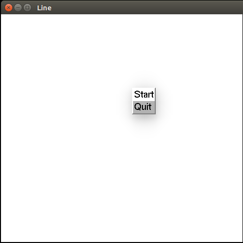
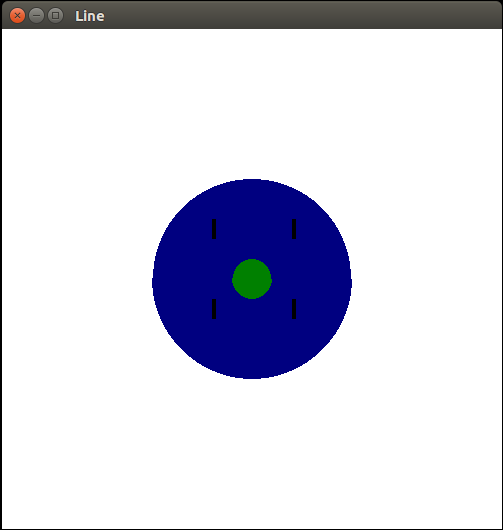
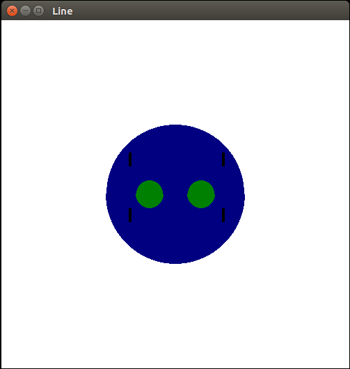
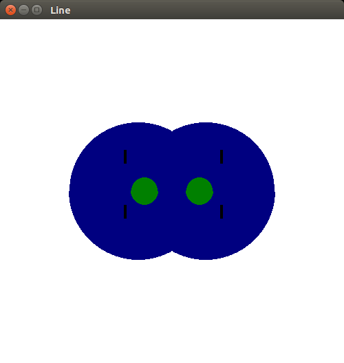
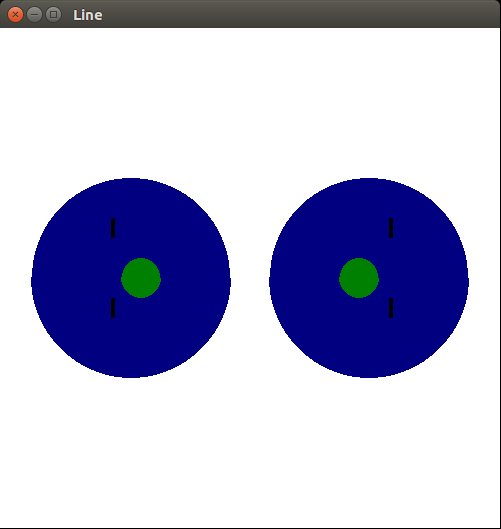

# Mitosis
## Steps to Run
Step 1: Install OpenGL on you Ubuntu System

Step 2: Compile turing.c using the command
	
	`g++ mitosis.cpp -lGL -lGLU -lglut -lm`

Step 3: Execute using the command 
	
	`./a.out`

Step 4: Right Click on the Launched Window and click on "Start"

## Stages of Run
Stage 1: Initial Cell

Stage 2: Nuclei and Chromosomes Replicate and Seperate from each other

Stage 3: Cell elongates

Stage 4: Two daughter cells are produced

